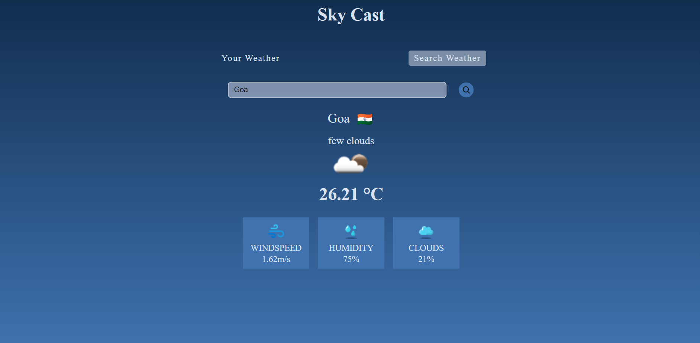

## Description
Your Weather provides two sections: "Your Weather" for current location details and "Search Weather" to find weather data for specific cities. It displays essential information such as temperature, weather description, icon, wind speed, humidity, and cloud cover. Flags representing the country of each searched city add visual appeal. The app offers real-time updates and a user-friendly interface for seamless navigation.

[Weather Cast](https://amancantgit.github.io/Your-Weather/)


## Features:
- **Your Weather**: Displays current location details including temperature, weather description, weather icon, wind speed, humidity, and cloud cover.
- **Search Weather:** Allows users to find weather data for specific cities worldwide.
- **Real-Time Updates:** Provides real-time weather updates for both current location and searched cities.
- **User-Friendly Interface:** Offers a seamless navigation experience for users.

## Technologies used: 
HTML/CSS & Vanilla JavaScript

## Getting Started
To get a local copy of the project up and running, follow these simple steps:

1. Clone the repository:
   ```sh
   git clone https://github.com/your-username/your-project.git

2. Run the project locally.
